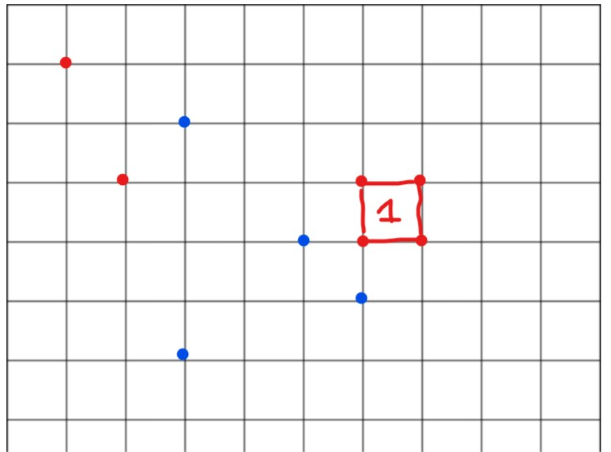

# SquareCraft AI 🟦🟥

**SquareCraft AI** is an intelligent extension of the SquareCraft-Challenge game, featuring an advanced AI agent capable of strategic decision-making in a competitive grid-based environment.

## 📌 Overview

The goal of this project is to implement an AI agent that analyzes the game state, makes optimal decisions, and adapts its strategy over time. It combines **Game Theory (Minimax)** and **Reinforcement Learning (Q-Learning)** within a clean, API-based architecture.

## 🎮 Game Description

SquareCraft is a two-player strategy game played on a grid.
- **Objective**: Score points by forming 1x1 squares using four of your own points.
- **Mechanics**: Turn-based gameplay on an NxN grid.
- **Strategy**: Block your opponent while maximizing your own score.

### 📜 Detailed Rules
1. **Setup**:
   - The game is played on an empty grid.
   - Two players participate, each using a different color (e.g., orange and blue).
2. **Gameplay**:
   - Players take turns placing one point at a time on any intersection of the grid.
   - Points must be placed at intersections, not on the lines.
3. **Scoring**:
   - A player scores 1 point when they form a perfect square with four of their own points.
   - A perfect square is formed by placing points at coordinates like (x, y), (x+1, y), (x, y+1), and (x+1, y+1).
   - When a square is formed, it is marked visibly, and the score is updated.
4. **End of Game**:
   - The game ends when all intersections on the grid are occupied.
   - The player with the most points wins.

### 🖼️ Example
In the image below, a square is formed by placing points at specific intersections, scoring 1 point:



### ✨ Why Play SquareCraft?
- **Simple to Learn, Hard to Master**: Easy rules, endless strategic possibilities.
- **Quick & Fun**: Perfect for a short game session or a series of matches.
- **Competitive**: Challenge friends or our intelligent AI agent to see who has the best tactical mind.

## 🧠 AI Architecture

The system uses a **Hybrid Strategy**:
1. **Minimax (Baseline Intelligence)**:
   - Depth-limited search with Alpha-Beta pruning.
   - Evaluates immediate tactical moves and simulates opponent responses.
2. **Q-Learning (Adaptive Layer)**:
   - Learns from experience by assigning values to local 3x3 grid patterns.
   - Reward system: +10 for a square, -1 for neutral moves.
   - Uses **Upstash Redis** for persistent memory in production.

## 📁 Project Structure

```text
squarecraft-ai/
├── frontend/                # Vanilla JS game (UI + interactions)
│   ├── assets/js/config.js  # Frontend configuration (API URL)
│   ├── index.html           # Setup page
│   └── game.html            # Game arena
└── backend/                 # FastAPI AI Agent
    ├── main.py              # FastAPI entry point
    ├── agent.py             # AI Controller (Minimax + RL)
    ├── minimax.py           # Tactical decision algorithm
    ├── qlearning.py         # Reinforcement learning logic
    └── Dockerfile           # Production container configuration
```

## 🚀 Deployment Guide

### Backend (Render + Upstash)
1. Create a **Redis** database on [Upstash](https://upstash.com/).
2. Deploy the `backend/` folder to **Render.com** as a Web Service.
3. Set Environment Variables:
   - `REDIS_URL`: Your Upstash connection string.
   - `ALLOWED_ORIGINS`: Your frontend URL.
4. Set Root Directory to `backend` and use the provided `Dockerfile`.

### Frontend (Vercel / GitHub Pages)
1. Update `frontend/assets/js/config.js` with your Render backend URL.
2. Deploy the `frontend/` folder.
3. **Important**: Set the **Root Directory** to `frontend` in your Vercel project settings.

## 🛠️ Local Development

### 1. Clone the repository
```bash
git clone https://github.com/moussahassana/SquareCraft-Challenge.git
cd SquareCraft-Challenge
```

### 2. Backend Setup
```bash
cd backend
poetry install
poetry run uvicorn main:app --reload
```

### 3. Frontend Setup
Simply open `frontend/index.html` in your browser or use a local dev server.

## 🤝 Contributing
We welcome contributions! To contribute:
1. **Fork** the repository.
2. **Create a branch** for your feature or bug fix (`git checkout -b feature/amazing-feature`).
3. **Commit** your changes (`git commit -m 'Add some amazing feature'`).
4. **Push** to the branch (`git push origin feature/amazing-feature`).
5. **Open a Pull Request**.

Please ensure your code follows the existing style and includes comments in English.

## 🧾 License
This project is licensed under the MIT License.

## 🙌 Acknowledgments
- Thanks to everyone who contributed to the development of SquareCraft-Challenge.
- Inspired by classic grid-based strategy games.
